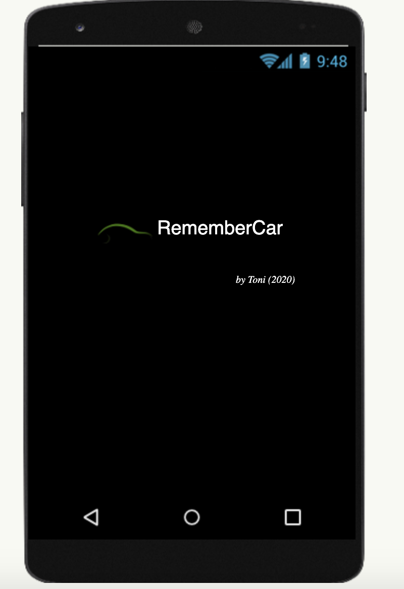
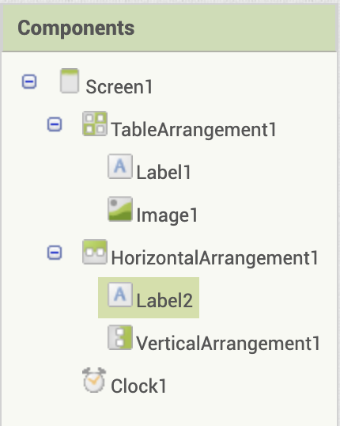
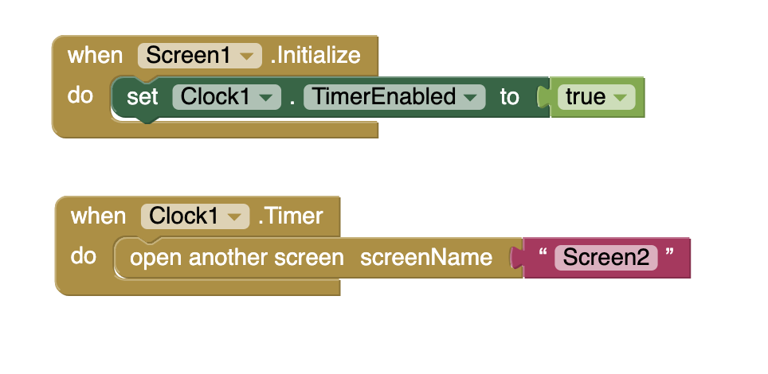

# Car Park

## Objectius:

### Pantalla d'inici 

Recordem, la pantalla inicial sempre és Screen1. Screen1  deixarà passar a la següent passats dos segons:

### Elements inicials

### Lògica

Passats dos segons, obrim pantalla 2:

