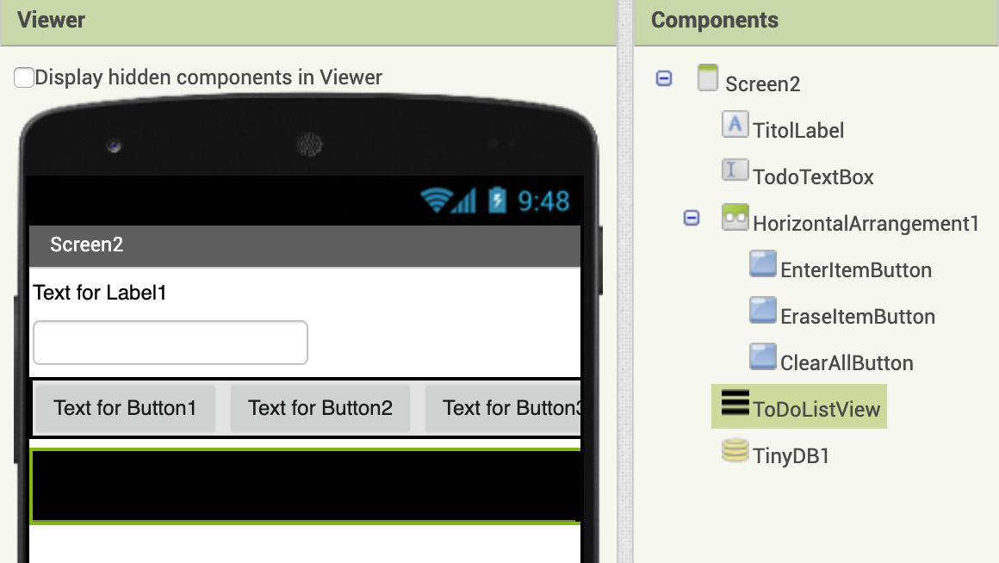
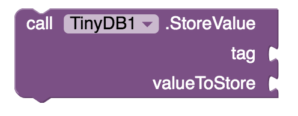
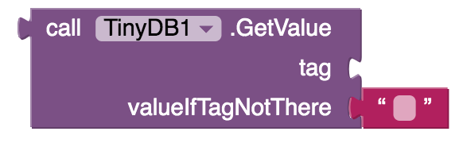

# TODO

## Layout

* [x] Crea en el nou projecte una configuració de components como la de la figura, canvia el nom dels components als de la figura:

* [x] Comprova ara si funciona el que has fet fins ara. Connecta el cable USB i prova.

### Introducció al TinyDB

 El component TinyDB  emmagatzema dades localment en el mòbil o tauleta. TinyDB pot ser accessible  només per un usuari o un dispositiu. A diferència deCloudDB que permet multiples usuaris emmagatzemar accedir i modificar dades en el núvol.

#### Emmagatzemar i extreure valors

Correspon als següents blocs:

En _tag_, col·loquem el nom de variable local on emmagatzemar la dada. A la cadena "" introduïm el nom del _tag_.

