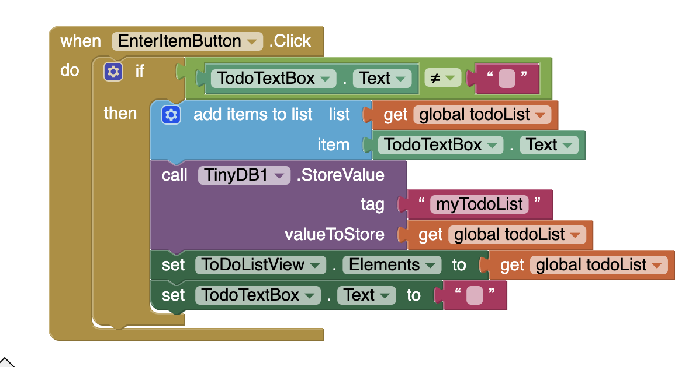

# TODO

## Layout Screen1

* [x] Crea en el nou projecte una configuració de components com la de la figura i canvia els noms dels mateixos:

* [x] Entra en mode blocks i crea l'algoritme de comprovació de la contrasenya, si s'encerta, ha de canviar a la pantalla 2 \(Screen2\), si no cal que apagui l'aplicació.

## Layout Screen2

* [x] Crea en el nou projecte una configuració de components como la de la figura, canvia el nom dels components als de la figura:

* [x] Comprova ara si funciona el que has fet fins ara. Connecta el cable USB i prova.

### Introducció al TinyDB

 El component TinyDB  emmagatzema dades localment en el mòbil o tauleta. TinyDB pot ser accessible  només per un usuari o un dispositiu. A diferència deCloudDB que permet multiples usuaris emmagatzemar accedir i modificar dades en el núvol.

#### Emmagatzemar i extreure valors

Correspon als següents blocs:

En _tag_, col·loquem el nom de variable local on emmagatzemar la dada. A la cadena "" introduïm el nom del _tag_. Com apunt dir que ens pot ajudar a passar dades entre pantalles \(SCREEN\).

## Inicialitzar pantalla screen2

## Guardar element en llista 

### Eliminar element de la llista i la base de dades

Si hi alguna cosa seleccionada a la llista \(index diferent de 0\), la podem eliminar de la llista i actualitzar la base de dades TinyDB i tornar la llista a estat de no seleccionat.

